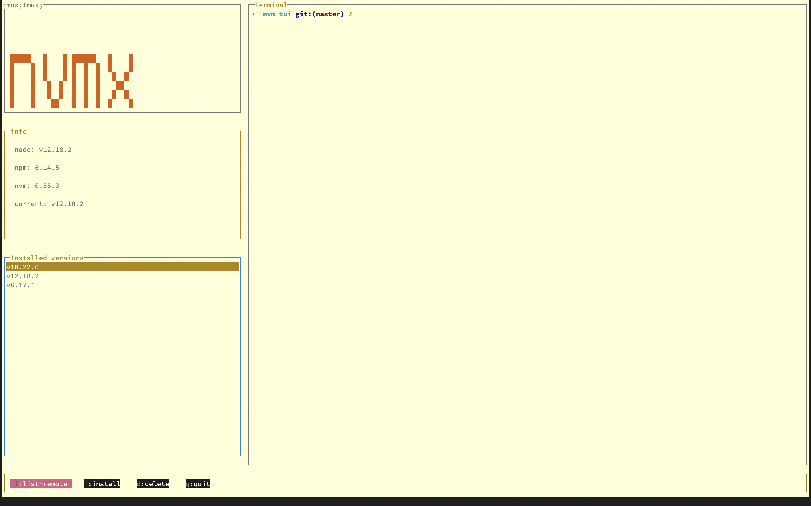

# :rainbow: blessed-themes :lollipop:

Themes for TUI (terminal user inteface) apps created using [blessed](https://github.com/chjj/blessed).


## Install
```
npm install blessed-themes
```

Using yarn
```
yarn add blessed-themes
```

Using pnpm
```
pnpm add blessed-themes
```

## Usage

Create a `styles.js` file like this:

```js
'use strict';

module.exports = function (colors) {

  // Destructure the colors for easy access
  const {
    primary: { background, foreground },
    normal: { red, green, blue, yellow, magenta, cyan },
  } = colors;

  return {
    colors, // this is for inline usage of theme colors for text and labels
    program: {
      bg: background,
      fg: foreground,
    },
    header: {
      border: {
        type: 'line',
        fg: foreground,
        bg: background,
      },
      style: {
        fg: red,
        bg: background,
      },
    },
  };
};
```

Using the theme

```js
// Import the theme colors
const colors = require('blessed-themes/theme/Gruvbox-Dark');
// Pass the theme colors to styles
const theme = require('./styles')(colors.colors);

// Initialize the program, to change the default color of the terminal screen
const program = blessed.program();

// Use the bg and fg colors from the theme for the program
program.bg(theme.program.bg);
program.fg(theme.program.fg);

// Get the styles of a widget from the theme
const { style, border } = theme.header;

const header = blessed.box({
  parent: screen,
  content: 'My Awesome CLI',
  top: 0,
  left: 0,
  width: '30%',
  height: '10%',
  border,
  style,
});

```

## Themes
You can find the list of theme names from [themes](/themes) folder.

### Dracula


### 3024.dark


### 3024.light


### Argonaut


### Afterglow


### Zenburn


### Gruvbox-Dark


### Gruvbox-Light


### Molokai


### Nord


### Tango


### Wombat


### Tomorrow-Night


### Solarized-Dark


### Solarized-Light


### Light Themes
- Gruvbox-Light
- Solarized-Light
